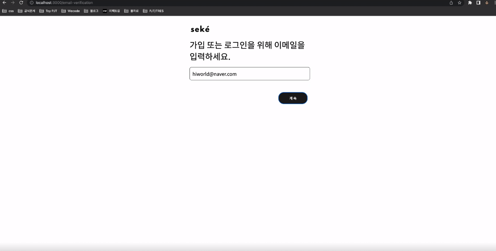
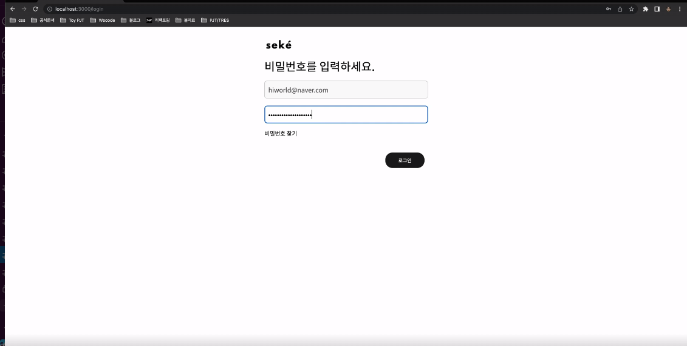
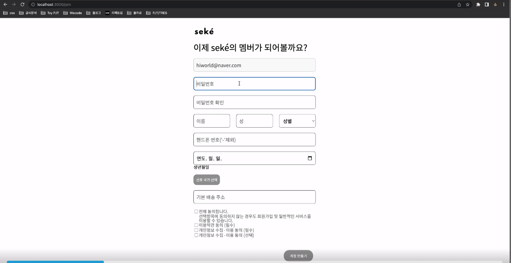
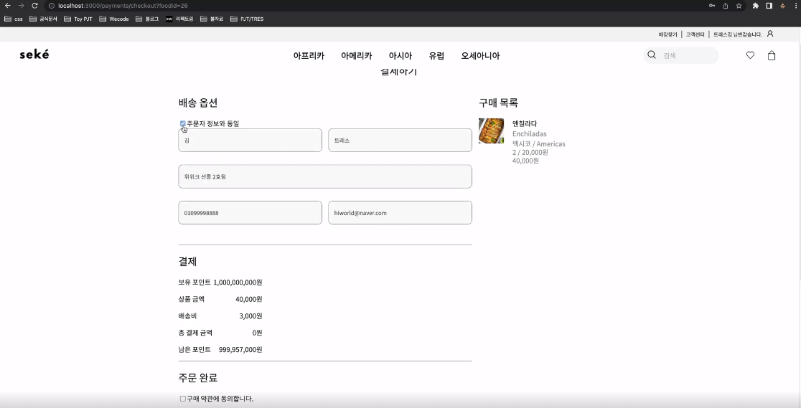

<h1>TRES<h1>

## FrontEnd

- <a href="YOUR_LINK_HERE">김태원</a>
- <a href="YOUR_LINK_HERE">연정아</a>
- <a href="YOUR_LINK_HERE">양진민</a>
- <a href="YOUR_LINK_HERE">전승범</a>

## BackEnd

- <a href="https://github.com/innichang">장인석(Inseok Chang)</a>
- <a href="https://github.com/msj102525">문승종</a>
- <a href="https://github.com/haaazzi">하지현</a>

#CC6699

<h1>STACKS</h1>

   

FRONTEND

  

  
    
    
    
      

  

 

BACKEND

  
   
  
  
  
  

 

CO-OP TOOLS

  
  
  
  
  
  

 

---

##About TRES

  <h1>True Ramen Execute Statement</h1>
  <h2>Execute Statement if(Ramen) it is True</h2>
  <h2>참이라면 실행하라 라는 의미를 가지고 있습니다.</h2>

  <h1>이메일검사</h1>
  
  <h2>이메일 입력 후 가입한 유저이면 로그인 유도</h2>
  <h2>이메일 입력 후 가입한 유저가 아니라면 회원가입 유도</h2>
  <h3>이메일 유효성 검사와 회원 유무를 동시에 진행해 로그인 시도 시에는 이메일과 비밀번호를 둘 다 확인해야 하는 번거로움을 없애주고 회원가입 시에는 이메일 중복 체크를 하는 번거로움을 없애줌으로써 쾌적하게 로그인 또는 회원가입으로 유도가 가능하다.</h3>

 

  <h1>로그인</h1>
  
  <h2>이메일 검사를 통과한 이메일 토대로 로그인</h2>
  <h3>이메일을 두번 입력 할 번거로움을 없앰</h3>
  <h3>로그인 실패 시 이메일과 비밀번호 둘다 체크 할 필요 없이 비밀번호만 틀리다는 메세지를 띄워서 비밀번호만 다시 체크 할 수 있도록 유도.</h3>

 

  <h1>회원가입</h1>
  
  <h2>회원가입 시 유저의 여러가지 정보를 받아 저장</h2>
  <h3>비밀번호는 hash화 하여 안전하게 저장 한다.</h3>
  <h3>저장 되어 있는 여러가지 정보를 바탕으로 추천상품, 주문 시 배송지 불러오기, 메인페이지 상단에 회원 닉네임 띄우기 등 다양한 기능으로 이어질 수 있도록 한다.</h3>

 

  <h1>결제</h1>
  
  <h2>회원가입 시 저장 되어 있는 유저의 정보를 가져오기.</h2>
  <h2>장바구니에 담겨 있는 제품들의 정보와 총 결제 금액 띄워주기</h2>
  <h3>회원가입 시 입력 한 정보를 가져와 두번 입력 할 필요 없도록 편의성을 고려했다.</h3>
  <h3>자동으로 총 결제 금액을 알려줌으로써 유저가 하나하나 계산 할 수고를 덜어줬다.</h3>
  <h3>결제 후 주문번호를 발급해 주문했던 제품의 상태와 정보를 확인 할 수 있도록 하였다.</h3>

